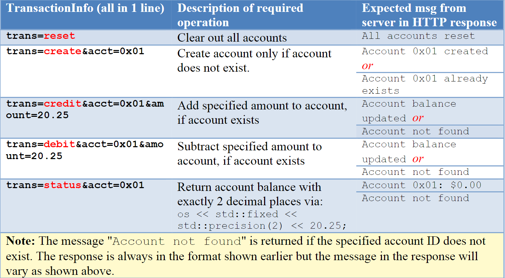

**Multithreaded Banking Application**

A simple multithreaded banking application that operates using standard HTTP
requests and responses. The bank consists of a collection of accounts. Each
account is identified by a unique account ID (a std::string) and its associated
balance (double). This information is best stored as a std::unordered_map, with
the account ID serving as the key.

The bank web-server is expected operate as follows:

1.It should listen and accept connections on a port specified as the
command-line argument.

2.For each connection, it should use a separate thread for processing the
request from the user. Each request will be a standard HTTP GET request in the
form (with each line terminated with a "\\r\\n"):

GET /TransactionInfoHTTP/1.1

Host: localhost:4000

Connection: close

Where, TransactionInfois a standard query stringin the form:
"trans=cmd&acct=AccountID&amount=amt". The cmdindicates type of operation to
perform. The account and amount information is optional. The expected operation
for and output for each command is shown below.

